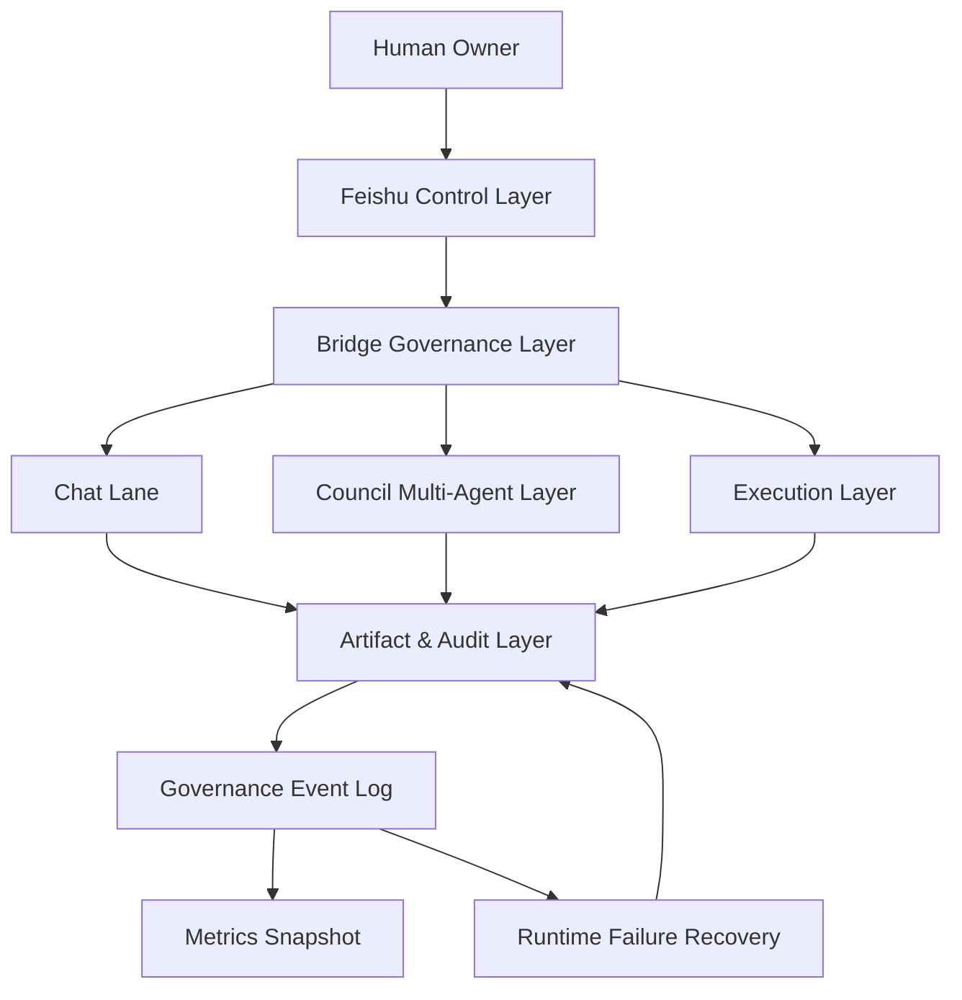

# AgentCommerce v1

一句话定位：AgentCommerce 是一个以 Feishu 为控制台、以 Council 为策略层、以 Execution 为执行层、以 Artifact 为治理核心的人类在环（HITL）AI 协作操作系统。

## 为什么不是普通 Agent Demo

普通 Agent Demo 关注“模型是否能回答”；AgentCommerce 关注“系统是否可治理、可审计、可恢复”。

核心差异：

1. `Artifact-first`：关键行为必须落地结构化产物，不依赖口头状态。
2. `HITL`：关键迁移与执行触发需要 owner 明确确认。
3. `Explicit gate control`：状态迁移 gate、publish gate、execution gate 分层控制。
4. `Governance over automation`：优先可追踪、可复盘、可安全失败，而非盲目自动化。

## 核心能力清单（v1）

1. Council 统一 schema 与状态机（plan/risk/review/decision/handoff）。
2. Feishu feedback mapping + owner intent normalization（保守映射）。
3. owner-confirmed apply 与 owner-confirmed execution dispatch。
4. policy publish FSM + alias semantic regression gate。
5. governance event log + metrics snapshot（含 recovery metrics）。
6. runtime failure/recovery/reconcile/degradation recovery 闭环。

## 系统总览架构



关键模块（真实文件）：

- `tools/council_bridge/feishu_message_router.py`
- `tools/council_bridge/council_artifact_state_machine.py`
- `tools/council_bridge/policy_publish_fsm.py`
- `tools/council_bridge/execution_handoff_gate.py`
- `tools/council_bridge/owner_confirmed_execution_dispatch.py`
- `tools/council_bridge/governance_event_log.py`
- `tools/council_bridge/governance_metrics_snapshot_job.py`
- `tools/council_bridge/runtime_failure_event_normalizer.py`
- `tools/council_bridge/runtime_recovery_attempt_runner.py`
- `tools/council_bridge/runtime_publish_reconcile_hook.py`
- `tools/council_bridge/runtime_event_log_degradation_recovery.py`

## 核心流程（Feishu -> Council -> Owner -> Execution/Audit）

1. owner 在 Feishu 提出任务或反馈。
2. Bridge Governance Layer 完成 ingress、scope observe、intent normalization。
3. Council Multi-Agent Layer 产出或修订 artifact。
4. owner 在 Feishu 给出审批意见（needs_fix/revise/approved/rejected）。
5. 状态机进行 validate；仅在 owner-confirmed 条件下 apply。
6. handoff artifact 通过 execution handoff gate。
7. 仅在明确 dispatch 协议下触发 Execution Layer。
8. 产出 execution receipt、governance events、metrics snapshot。
9. 若失败，进入 Runtime Failure Recovery 闭环并补齐审计证据。

最典型端到端流程见：[Example Flow v1](docs/example-flow-v1.md)。

## Governance 与 Runtime Failure Recovery

治理能力（已实现）：

- Scope Validator（observe mode）与 router 集成。
- Policy Publish FSM（proposed/review/confirmed/applied/rejected/rolled_back）。
- Alias Version Gate（发布前语义回归门禁）。
- execution gate 与 dispatch 协议隔离（handoff_ready 不等于自动执行）。

运行时恢复能力（已实现）：

- `runtime_failure_event` 标准化。
- `runtime_recovery_attempt` 最小重试与人工介入记录。
- `runtime_reconcile_report` 发布半提交对账。
- `runtime_event_log_degradation` 降级队列与 replay。
- recovery metrics 扩展到 `governance_metrics_snapshot`。

## 当前完成状态（Phase 6.5 ~ 7.1）

- Phase 6.5 P1：T1~T6 已完成。
- Phase 7.1：A~E 已完成。
- 最近全量回归：`py -m pytest -q`，`331 passed`。

## 明确边界（当前未实现）

1. 未实现治理 UI 面板。
2. 未实现分布式调度与复杂多进程一致性。
3. 未实现 HA/多活容灾。
4. 未实现自动化修复编排引擎（当前为保守恢复策略）。

## 文档入口

- [Docs Index](docs/index.md)
- [Architecture v1](docs/architecture-v1.md)
- [Final Delivery Report v1](docs/final-delivery-report-v1.md)

## Roadmap（Phase 7.2 / 8）

1. Phase 7.2：恢复策略编排与 runbook，提升 MTTR 与人工操作一致性。
2. Phase 8：对外展示包装与轻量可视化，形成可复用交付模板。

## 快速开始

```powershell
py -m pip install -r requirements.txt
py -m pytest -q
```

样例可见：`docs/*_samples_v0.1/`、`docs/governance_metrics_snapshot_recovery_extended.json`。
