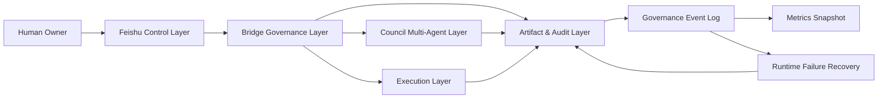
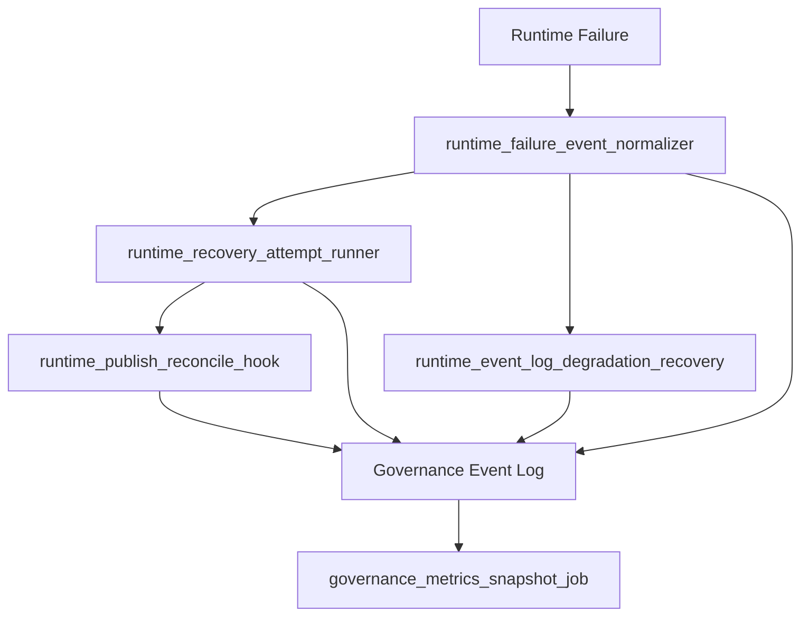
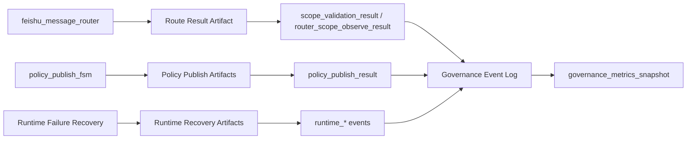

# Architecture v1（Phase 6.5 ~ 7.1）

## 1. 文档范围

本文档描述 AgentCommerce 在 Phase 6.5 ~ 7.1 的已实现架构与治理边界，覆盖 Feishu 控制、Bridge 治理、Council 协作、Execution 门禁、Artifact 审计、Runtime Failure Recovery、Governance Event Log 与 Metrics Snapshot。

当前为建议外的 non-goals：UI 面板、分布式调度、HA/多活、自动修复编排引擎。

## 2. 分层架构

1. Feishu Control Layer：owner 入口、反馈与确认协议载体。
2. Bridge Governance Layer：router、scope observe、intent normalization、policy publish gate。
3. Council Multi-Agent Layer：planner/researcher/critic/strategist/reviewer/reporter 角色协作与策略产物。
4. Execution Layer：handoff gate + owner-confirmed dispatch，受控进入执行。
5. Artifact & Audit Layer：结构化产物、lineage、审计记录。
6. Runtime Failure Recovery：failure normalization、recovery attempt、publish reconcile、event degradation replay。
7. Governance Event Log + Metrics Snapshot：统一事件沉淀与周期指标快照。

## 3. 系统总览图

## 4. 控制流 vs 数据流

### 4.1 控制流

`Feishu message -> feishu_message_router -> scope_validator(observe) -> owner_intent_normalization -> mapping/rework adapters -> state machine / publish FSM / execution gates`

### 4.2 数据流

`router result + council artifacts + publish artifacts + runtime artifacts -> governance_event_log -> governance_metrics_snapshot_job`

设计约束：控制流负责放行判定，数据流负责证据沉淀；两者解耦但可追溯。

## 5. Gate / FSM / Recovery 边界

1. State Validator Authority Boundary：`council_artifact_state_machine.py` 决定状态迁移合法性，mapping 仅建议不放行。
2. Policy Publish FSM Boundary：`policy_publish_fsm.py` 仅管理 alias version 发布状态，不改变 router 主决策。
3. Execution Gate Boundary：`execution_handoff_gate.py` + `owner_confirmed_execution_dispatch.py` 控制执行入口，`handoff_ready` 不等于自动执行。
4. Runtime Recovery Boundary：恢复模块只写审计与建议，不越权改主状态机语义。

## 6. Artifact 与 Event 关系

| 类型 | 生产者 | 消费者 | 作用 |
|---|---|---|---|
| Council artifacts (`plan/risk/review/decision/handoff`) | Council Multi-Agent Layer | state machine / handoff gate | 策略对象与审批对象 |
| Policy artifacts (`policy_publish_request/result/audit_pack`) | policy publish FSM | config center / audit | 发布治理与回滚证据 |
| Runtime artifacts (`runtime_failure_event/recovery_attempt/reconcile_report/event_log_degradation`) | Runtime Failure Recovery | operators / snapshot job | 失败恢复与对账证据 |
| Governance events | governance_event_log | metrics snapshot | 统一观测事件流 |
| Metrics snapshot | governance_metrics_snapshot_job | owner / report docs | 周期指标汇总 |

## 7. Runtime Failure Recovery 闭环图

## 8. Artifact / Event / Metrics 流转图

## 9. 关键模块映射（真实文件）

- Feishu Control Layer：`tools/council_bridge/feishu_message_router.py`
- Bridge Governance Layer：`tools/council_bridge/scope_validator.py`、`tools/council_bridge/policy_config_center.py`、`tools/council_bridge/policy_publish_fsm.py`
- Council Multi-Agent Layer：`tools/council_bridge/council_role_contract.py`、`tools/council_bridge/council_artifact_schema.py`、`tools/council_bridge/council_artifact_state_machine.py`
- Execution Layer：`tools/council_bridge/execution_handoff_gate.py`、`tools/council_bridge/owner_confirmed_execution_dispatch.py`、`tools/council_bridge/execution_dispatch_adapter.py`
- Runtime Failure Recovery：`tools/council_bridge/runtime_failure_event_normalizer.py`、`tools/council_bridge/runtime_recovery_attempt_runner.py`、`tools/council_bridge/runtime_publish_reconcile_hook.py`、`tools/council_bridge/runtime_event_log_degradation_recovery.py`
- Governance Event Log / Metrics Snapshot：`tools/council_bridge/governance_event_log.py`、`tools/council_bridge/governance_metrics_snapshot_job.py`

## 10. 设计原则

1. Artifact-first：关键状态变化必须落结构化 artifact。
2. HITL：owner 是关键迁移与执行触发门禁。
3. Governance over automation：优先审计可追踪，不追求盲目自动化。
4. Explicit gate control：mapping 不等于批准，handoff_ready 不等于执行。
5. Auditability：每次判定、失败、恢复都有事件或产物证据。
6. Safe failure & reconciliation：允许保守降级，必须可对账、可回放。

## 11. 已实现 vs 后续方向

### 11.1 已实现

- Phase 6.5 P1：Scope Validator、observe-mode router integration、Policy Publish FSM、Alias Version Gate、Incremental Event Log、Metrics Snapshot Job。
- Phase 7.1：Failure Event Normalizer、Recovery Attempt Runner、Publish Failure Reconcile Hook、Event Log Degradation Recovery、Recovery Metrics Extension。

### 11.2 后续方向（未实现）

- 恢复策略编排与 runbook 自动化（Phase 7.2）。
- 轻量可视化与对外交付包装（Phase 8）。
- 分布式调度与 HA（长期方向，当前 non-goal）。
